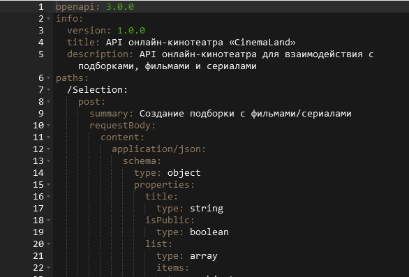

# Проектные работы:

[1. Создание спецификации на разработку сайта для онлайн-кинотеатра.](#1-создание-спецификации-на-разработку-сайта-для-онлайн-кинотеатра) 

[2. Разработка кликабельного прототипа экрана приложения для iOS, c использованим инструментов Figma.](#2-разработка-кликабельного-прототипа-экрана-приложения-для-ios-c-использованим-инструментов-figma) 

[3. Моделирование бизнес-процессов в соответствии с нотацией BPMN 2.0.](#3-моделирование-бизнес-процессов-в-соответствии-с-нотацией-bpmn-20) 
 
[4. Решение бизнес-задач компании осуществляющей авиаперевозки.](#4-решение-бизнес-задач-компании-осуществляющей-авиаперевозки)  

## 1. Создание спецификации на разработку сайта для онлайн-кинотеатра.

- **Проведено интервью с заказчиком;**
- **Формализованы функциональные и нефункциональные требования;**
- **Построена диаграмма классов (class diagram)**

 

**диаграмма вариантов использования (use-case diagram)**

- **Описаны варианты использования;**
- **Разработана Swagger-документация**

  
https://app.swaggerhub.com/apis/ANDREIDOCHKIN/CL1/1.0.0

Ссылка на всю документацию  
https://docs.google.com/document/d/1v8mpufL2YdOzxAL38y0NUvW5Q7qRLE8wGLZH68Lt9IU/edit?usp=sharing

## 2. Разработка кликабельного прототипа экрана приложения для iOS, c использованим инструментов Figma.

  

https://www.figma.com/proto/9gKpSSt0VvjqWkwJutIXJF/%D0%9A%D0%BB%D0%B8%D0%BA%D0%B0%D0%B1%D0%B5%D0%BB%D1%8C%D0%BD%D1%8B%D0%B9-%D0%BF%D1%80%D0%BE%D1%82%D0%BE%D1%82%D0%B8%D0%BF-%D1%8D%D0%BA%D1%80%D0%B0%D0%BD%D0%B0-%D0%BF%D1%80%D0%B8%D0%BB%D0%BE%D0%B6%D0%B5%D0%BD%D0%B8%D1%8F-%D0%B4%D0%BB%D1%8F-iOS?type=design&node-id=1-436&t=DP8SBVulKeXhn2tu-1&scaling=scale-down&page-id=0%3A1&starting-point-node-id=1%3A436&mode=design

## 3. Моделирование бизнес-процессов в соответствии с нотацией BPMN 2.0.

**Отрисован процесс “Заказ пошива одежды в ателье”.  
Детализирован подпроцесс предоплаты.**

**Отрисован процесс "Пополнение счета моб. телефона через банковское приложение".**

## 4. Решение бизнес-задач компании осуществляющей авиаперевозки.

**Анализ базы данных.  
Составление SQL-запросов для получения необходимых данных.**

**Описание базы данных**

https://edu.postgrespro.ru/bookings.pdf

**Решение бизнес задач компании**

*№1 Выведите названия самолётов, которые имеют менее 50 посадочных мест.*

select model, count(seat_no) "Посадочные места"  
from seats s  
join aircrafts a on a.aircraft_code = s.aircraft_code  
group by a.aircraft_code  
having count(seat_no) < 50

*№2 Выведите процентное изменение ежемесячной суммы бронирования билетов, округленной до сотых.*

with recursive r as (  
    select min(date_trunc('month', book_date)) "Месяц" from bookings  
    union  
    select "Месяц" + interval '1 month' as "Месяц"  
    from r  
    where "Месяц" < (select max(date_trunc('month', book_date)) from bookings))  
select "Месяц"::date, t."Сумма",  
    round(((t."Сумма") - lag(t."Сумма") over (order by "Месяц")) / (lag(t."Сумма") over (order by "Месяц")) * 100, 2) as "% от прошлого месяца"  
from r  
left join (  
    select date_trunc('month', book_date), sum(total_amount) as "Сумма"  
    from bookings  
    group by date_trunc('month', book_date)) t on "Месяц" = date_trunc  
order by 1

*№3 Выведите названия самолётов без бизнес-класса. Используйте в решении функцию array_agg.*

select a.model  
from (  
    select aircraft_code, array_agg(fare_conditions)  
    from (  
   	 select *  
   	 from seats  
   	 order by aircraft_code, fare_conditions) t  
    group by aircraft_code) t  
join aircrafts a on a.aircraft_code = t.aircraft_code  
where array_position(t.array_agg, 'Business') is null

*№4 Найдите процентное соотношение перелётов по маршрутам от общего количества перелётов.  
Выведите в результат названия аэропортов и процентное отношение.  
Используйте в решении оконную функцию.*

select departure_airport_name, arrival_airport_name,  
    count(fv.flight_id) *100 / sum(count(fv.flight_id)) over () "Процентное отношение"  
from flights_v fv     
group by departure_airport_name, arrival_airport_name
    
*№5 Выведите количество пассажиров по каждому коду сотового оператора. Код оператора – это три символа после +7*

select substring(contact_data->>'phone', 3, 3) "Код оператора", count(passenger_id) "Кол-во пассажиров"  
from tickets  
group by substring(contact_data->>'phone', 3, 3)

*№6 Классифицируйте финансовые обороты (сумму стоимости билетов) по маршрутам:  
до 50 млн – low  
от 50 млн включительно до 150 млн – middle  
от 150 млн включительно – high  
Выведите в результат количество маршрутов в каждом полученном классе.*

select amount_class, count(*) "Количество маршрутов"  
from (  
    select departure_airport, arrival_airport, sum(tf.amount),  
   	 case  
   		 when sum(tf.amount) < 50000000 then 'low'  
   		 when sum(tf.amount) >= 50000000 and sum(tf.amount) < 150000000 then 'middle'  
   		 else 'high'  
   	 end amount_class  
    from flights_v fv  
    join ticket_flights tf on tf.flight_id = fv.flight_id  
    group by departure_airport, arrival_airport) t  
group by amount_class

*№7 Вычислите медиану стоимости билетов,
медиану стоимости бронирования и отношение медианы бронирования к медиане стоимости билетов, результат округлите до сотых.*

select percentile_cont(0.5) within group (order by total_amount) "Медиана стоимости бронирования",  
    (select percentile_cont(0.5) within group (order by amount)  
    from ticket_flights tf) "Медиана стоимости билетов",  
    (percentile_cont(0.5) within group (order by total_amount) / (select percentile_cont(0.5) within group (order by amount)  
    from ticket_flights tf))::numeric (4, 2) as "Отношение"  
from bookings b

